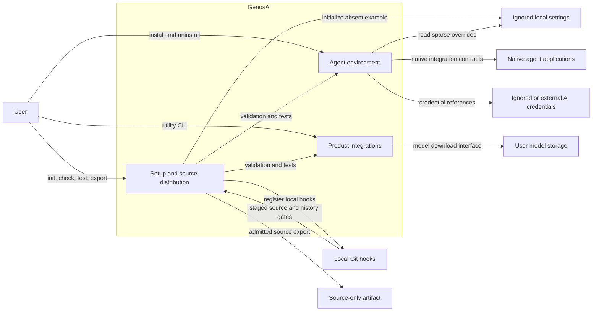

# Repository boundary

Maintained components, command entrypoints and user-data boundaries; component internals stay with their owners.

```mermaid
flowchart LR
  subgraph Project[GenosAI]
    Agents[Agent environment]
    Integrations[Product integrations]
    Tools[Setup and source distribution]
  end
  User[User] -->|init, check, test, export| Tools
  User -->|install and uninstall| Agents
  User -->|utility CLI| Integrations
  Tools -->|initialize absent example| Local[Ignored local settings]
  Tools -->|validation and tests| Agents
  Tools -->|validation and tests| Integrations
  Git[Local Git hooks] -->|staged source and history gates| Tools
  Tools -->|register local hooks| Git
  Tools -->|admitted source export| Distribution[Source-only artifact]
  Agents -->|read sparse overrides| Local
  Agents -->|native integration contracts| Clients[Native agent applications]
  Agents -->|credential references| Keys[Ignored or external AI credentials]
  Integrations -->|model download interface| Models[User model storage]
```
